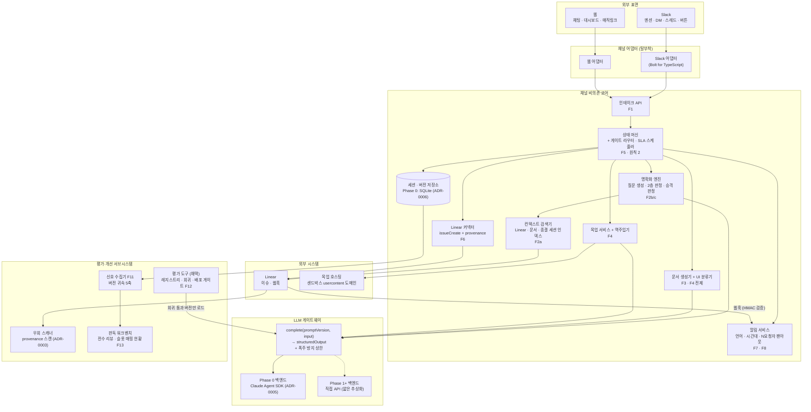
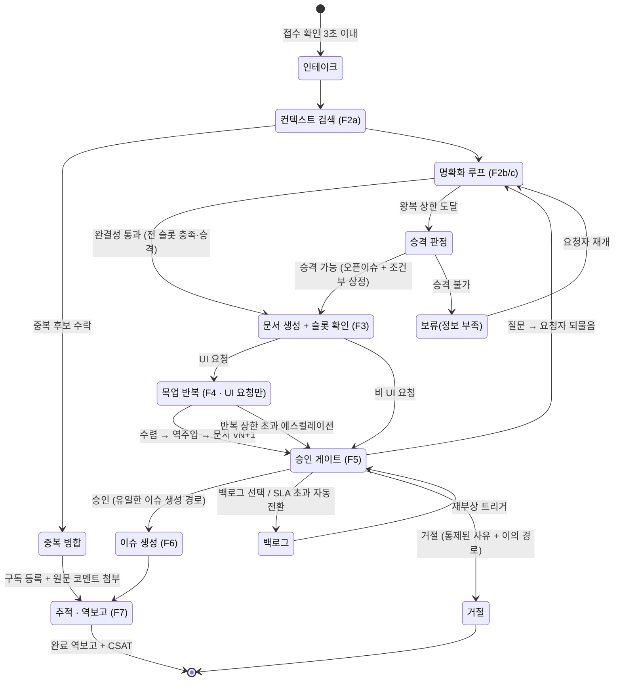
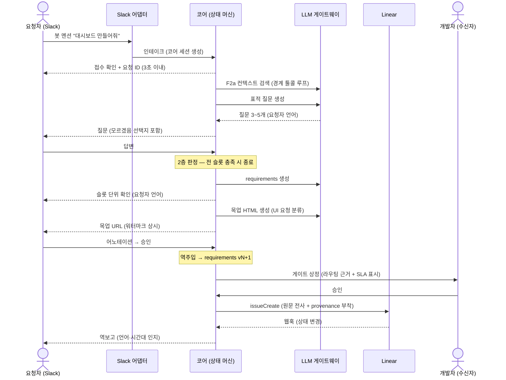
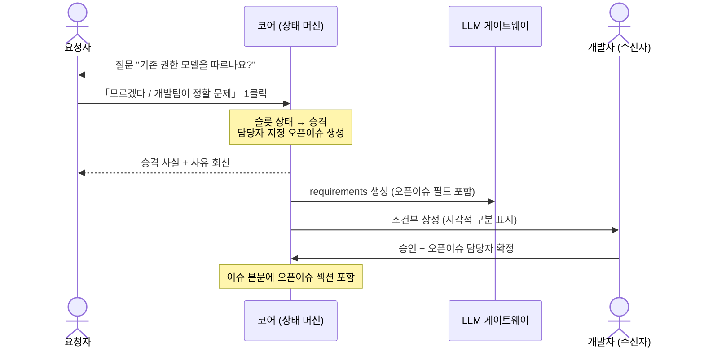
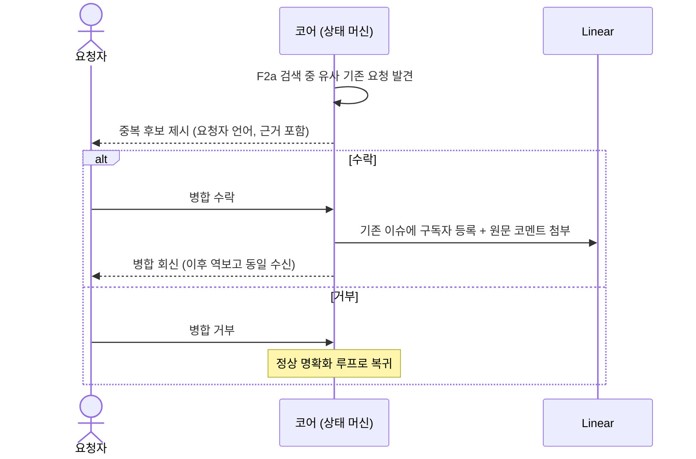
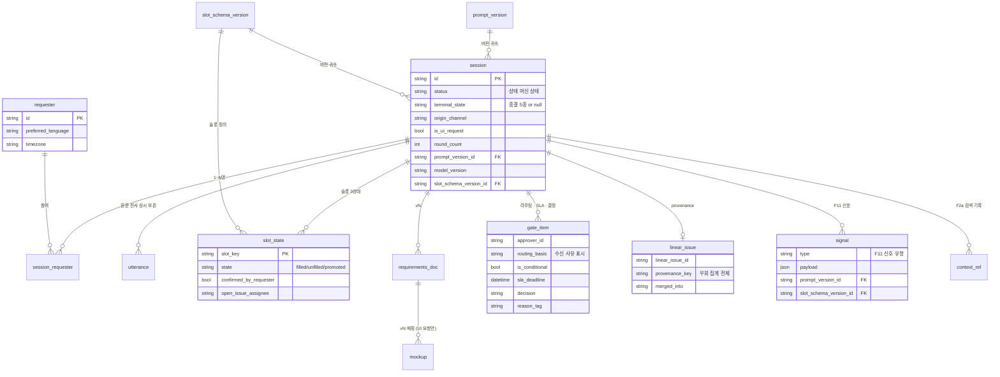

# PM Jude 아키텍처

> 성격: [PRD v1.4](PRD.md) §7의 논리 경계를 시각화·구체화한 문서. "어떻게"의 상세는 개발팀 재량이며, Phase 0 착수에 필요한 결정만 확정 상태로 담는다([ADR](docs/adr/) 참조). 나머지 기술 선택은 「결정 대기」로 남긴다. 브라우저 조감은 [docs/architecture.html](docs/architecture.html) — 이 문서 mermaid 블록의 렌더링이며, 블록 수정 시 `node scripts/check-arch-sync.mjs --write`로 동기화한다. 용어는 [CONTEXT.md](CONTEXT.md), 데이터 모델 상세는 [docs/data-model.md](docs/data-model.md).

## 시스템 구성도

채널 어댑터는 코어 API만 호출하고, 코어의 LLM 호출은 전부 게이트웨이를 거친다. 게이트웨이 외부는 백엔드(Phase 0 Agent SDK / Phase 1+ 직접 API)를 모른다.

## 상태 머신 — 요청 라이프사이클

전이의 결정 주체는 코드 상태 머신이다([ADR-0001](docs/adr/0001-fixed-orchestration.md)). 종결 상태 5종은 모두 회신 발송 없이는 진입이 완료되지 않는다(원칙 5).

코드로 강제되는 하드 제약:

- 승인 없는 Linear 이슈 생성 불가 — `gate --> issue`가 유일한 경로
- 룰 층 미통과 시 게이트 진입 불가 — 승격 경로만 예외
- 회귀 미통과 프롬프트/스키마 버전의 런타임 로드 불가(F12)
- 종결 상태 전이 시 회신 발송 없이는 세션 종료 불가
- 목업 코드의 개발팀 전달 불가 — 이미지·URL 형태만

## 대표 시퀀스

### 해피패스 — UI 요청 접수부터 역보고까지

### 승격 — 요청자 해소 불가 슬롯의 조건부 상정

### 중복 병합 — 새 이슈 없는 종결

## 데이터 모델 ERD

필드 상세와 결정 대기 항목은 [docs/data-model.md](docs/data-model.md).

## 컴포넌트와 담당 기능

| 컴포넌트 | 책임 | 관련 기능 | 도입 Phase |
|---|---|---|---|
| 인테이크 API | 채널 무관 수신, 세션·프로필 생성, 즉시 확인 | F1 | 1 (PoC 축소판은 0) |
| 상태 머신 | 단계 전이 결정, 하드 제약 강제, 게이트 라우팅·SLA 스케줄링 | 원칙 2·5, F5 | 1 |
| 명확화 엔진 | 표적 질문 생성, 2층 완결성 판정, 승격 판정 | F2b/c/e | 0 (프롬프트) → 1 (전체) |
| 컨텍스트 검색기 | Linear·문서·종결 세션 인덱스, 경계 툴콜 루프, 중복 후보 | F2a | 1 |
| 문서 생성기 + UI 분류기 | requirements/tasks 생성, 슬롯 단위 확인, 목업 실행 여부 분류 | F3, F4 전제 | 0 (프롬프트) → 1 |
| 목업 서비스 + 역주입기 | 목업 생성·호스팅·버전 매핑, 어노테이션의 문서 흡수 | F4 | 2 |
| Linear 커넥터 | issueCreate, provenance 부착, 병합 처리 | F6 | 0 (수동/1개) → 1 |
| 알림 서비스 | 회신·역보고·리마인더, 언어·시간대 인지, N요청자 팬아웃 | F7, F8 | 1 |
| 세션·버전 저장소 | 세션·전사·슬롯·신호 + 버전 레지스트리 저장 | F11 전제 | 0 (SQLite) |
| LLM 게이트웨이 | 프로바이더 추상화, 폭주 상한, 회귀 통과 버전만 로드 | 원칙 4, F12, F14 | 0 |
| 신호 수집기 | 다운스트림 신호 수집·버전 귀속 5축 | F11 | 1 |
| 우회 스캐너 | provenance 없는 기능 요청 이슈 집계 | F6, §10 | 1 |
| 평가 도구 (채택) | 트레이싱·프롬프트 레지스트리·회귀 실행·배포 게이트 | F12 | 2 |
| 판독 워크벤치 | 전수 리뷰 큐, 실패 분류, 슬롯 매핑 현황, 카나리 관리 | F13 | 2 |
| 웹 어댑터 | 채팅 인테이크, 대시보드, 매직링크 뷰어 | F1, F9 | 1 (경량 뷰어) → 2 (완결 표면) |
| Slack 어댑터 | 멘션·DM·스레드 명확화, 버튼 게이트, DM 역보고 | F1 | 0 (PoC) → 1 (1차 표면) |

## 확정된 기술 결정 (Phase 0)

| 결정 | 내용 | 근거 |
|---|---|---|
| 하네스·런타임 | Claude Agent SDK + TypeScript | [ADR-0005](docs/adr/0005-phase0-agent-sdk-typescript.md) |
| 세션 저장소 | SQLite (Phase 1 Postgres 전환 전제) | [ADR-0006](docs/adr/0006-phase0-sqlite.md) |
| 오케스트레이션 | 코드 상태 머신 + 단계 내 구조화 LLM 호출 | [ADR-0001](docs/adr/0001-fixed-orchestration.md) |
| 우회 측정 | provenance 스캔 자동 집계 | [ADR-0003](docs/adr/0003-provenance-bypass-metric.md) |
| 베이스라인 | 소급 아카이브 분석 | [ADR-0004](docs/adr/0004-retrospective-baseline.md) |
| 문서 원칙 | requirements 단일 진실 원천 + 역주입 + 원문 보존 | [ADR-0002](docs/adr/0002-doc-single-source-of-truth.md) |

## 결정 대기 항목

기술 선택 중 이 문서가 열어 두는 것: 프로바이더 추상화 구현체(Vercel AI SDK / LiteLLM / Bedrock Converse — Phase 1 전환 시 확정), 목업 호스팅 상세(R2+Workers 권장선), 평가 도구(Langfuse / promptfoo — Phase 2 채택), 배포 환경. 웹 프레임워크는 Next.js + shadcn/ui로 확정됐다([ADR-0008](docs/adr/0008-frontend-nextjs-shadcn.md)). 수치·정책 미결정 항목의 전체 목록은 PRD §12.
