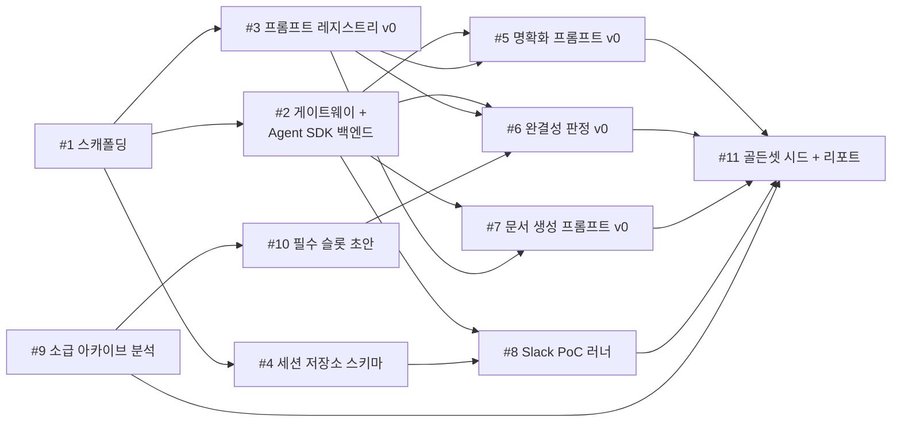

# Phase 0 실행 계획 — PoC + 소급 베이스라인

> 근거: [PRD v1.4](../PRD.md) §9 Phase 0, F14. 기술 결정: [ADR-0005](adr/0005-phase0-agent-sdk-typescript.md)(Agent SDK + TypeScript), [ADR-0006](adr/0006-phase0-sqlite.md)(SQLite). 개별 실행 단위는 [이슈 보드](../issues/index.html)의 티켓 #1~#11, 웹 우선 전환은 #16.

## 목표 — 서로 독립적인 두 갈래

**갈래 A — 파이프라인 PoC (웹 우선, [ADR-0007](adr/0007-web-first-verification.md))**: 인테이크 → 명확화 루프 → 2층 완결성 판정 → requirements 문서 생성 파이프라인을 채널 비의존 코어 러너 + 로컬 웹 표면(`pnpm web`)에서 먼저 완성·검증. 하네스는 Claude Agent SDK. Slack 어댑터 운영(#8)과 외부 API 사용(Slack·Linear)은 후순위 — 채택 가설(완주율·재사용률)은 스테이크홀더의 서식지(Slack) 복귀 후 재검증한다.

**갈래 B — 소급 아카이브 분석**: 최근 6~12개월 Linear 아카이브에서 재질문·reopen·스펙 편집을 추출해 ① 재질문 빈도 베이스라인(§10 감소율 지표의 분모), ② 재질문 유형 분류표(F2e 필수 슬롯 목록의 근거)를 산출.

두 갈래는 병렬 진행 가능하며, 갈래 B의 분류표가 갈래 A의 슬롯 초안(티켓 #10)에 합류한다.

## 범위 제외

목업(F4), Linear 웹훅(F7), 대시보드(F9), 관리 설정(F10), 평가 도구 채택(F12). PoC의 목적은 인프라가 아니라 프롬프트 품질·채택 신호·슬롯 근거다.

## 작업 분해와 의존성

| # | 작업 | 핵심 산출물 | 갈래 |
|---|---|---|---|
| 1 | 리포지토리 스캐폴딩 | TypeScript·pnpm·SQLite 마이그레이션 기반 | A |
| 2 | LLM 게이트웨이 + Agent SDK 백엔드 | `complete(promptVersion, input) → structuredOutput`, 도구 비활성·타임아웃·비용 로깅 | A |
| 3 | 프롬프트 레지스트리 v0 | 버전 참조 강제, `regression_passed` 플래그 필드 | A |
| 4 | 세션 저장소 스키마 | 세션·전사·슬롯·신호·버전 귀속([data-model.md](data-model.md)) | A |
| 5 | 명확화 프롬프트 v0 | 표적 질문 생성 — 해석 다중 전개, 「모르겠다」 경로 포함 | A |
| 6 | 완결성 판정 프롬프트 v0 + 룰 층 초안 | 슬롯 3상태 판정, 금칙 모호어 사전 초안 | A |
| 7 | requirements 생성 프롬프트 v0 | EARS·Given-When-Then, 오픈이슈 필드 | A |
| 8 | Slack PoC 러너 — 후순위 (ADR-0007) | Bolt 스레드 인테이크 → 명확화 → 문서 전달. 코어 러너의 얇은 어댑터로 유지, 운영은 웹 검증 뒤로 | A |
| 9 | 소급 아카이브 분석 | 재질문 유형 분류표 + 베이스라인 수치 | B |
| 10 | 필수 슬롯 초안 (F2e) | 분류표에서 도출, 슬롯 ↔ 재질문 유형 매핑 근거 | B→A |
| 11 | 골든셋 시드 + PoC 리포트 | 익명화 세션 큐레이션, 검증 결과·중단 기준 판정 | A+B |

## 산출물 체크리스트 (PRD §9)

- [ ] PoC 리포트 — 개발자 검토 통과율, 세션 완주율, 요청자 해소 불가 비율
- [ ] 프롬프트 v0 3종 (레지스트리 등록, 버전 참조)
- [ ] 초기 골든셋 시드 (PoC 세션 익명화)
- [ ] 재질문 유형 분류표 + 필수 슬롯 초안 (F2e)
- [ ] 베이스라인 수치 (§10 지표 분모)

## 중단·전환 기준

수치 임계값은 PoC 진행 중 확정한다(PRD §12-10). 판정 시점은 티켓 #11 리포트.

| 분기 | 신호 | 대응 |
|---|---|---|
| (a) 정제 품질 미달 | 명확화 후 문서의 개발자 검토 통과율 기준 미만 | Phase 1 착수 보류, 프롬프트·슬롯 재설계 후 PoC 재실행 |
| (b) 마찰 과다 | 스테이크홀더 세션 완주율 기준 미만 | Phase 1 범위를 질문 수 축소·인테이크 단순화로 재정의, 목업·대시보드 후순위화 |
| (c) 전제의 부분적 오류 | 소급 분석에서 요청자 해소 불가 유형 다수 | 명확화 무게중심을 F2b(대화)에서 F2a(검색)·F2c(승격)로 이동, 제품 서술 재정의 — 실패가 아니라 설계 정보 |

## Phase 0 이후

Exit 기준(F14): PoC 목표 달성 시 Agent SDK 하네스를 직접 API로 교체하고, 전환 전후 골든셋 시드로 출력 동등성을 확인한다. Phase 1 범위는 PRD §9 참조.
