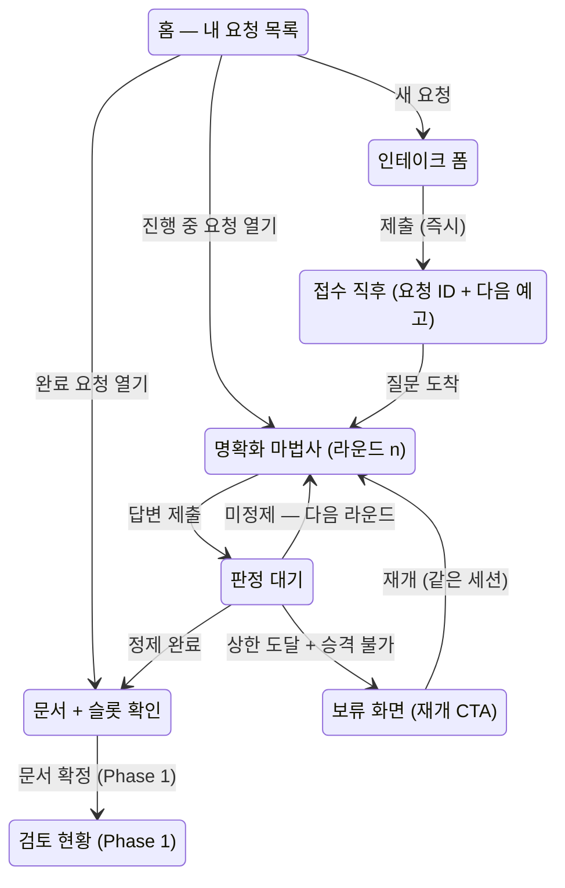

# 요청자 여정 UX 설계 — 세션 상태 머신의 화면 대응

> 성격: [ARCHITECTURE.md §상태 머신](../../ARCHITECTURE.md)과 [PRD §5·§7](../prd/functional-requirements.md)이 정본인 요청 라이프사이클을, 요청자가 보는 화면·상호작용으로 대응시키는 설계 문서다(보드 #23, 운영자 지시). 화면 구현은 이 설계의 승인 뒤에 진행한다. 용어는 [CONTEXT.md](../../CONTEXT.md)를 따른다.
>
> 개정 이력: 초안(#23) → 오픈 질문 확정(#25, #29~#32)·갭 구현(#35) → **vNext(#34)** — 스트레스 테스트(#28) 발견 S-1~S-9 흡수 → **자료 첨부 반영(#45)** — F1-Attach의 화면·계약([ADR-0011](../adr/0011-attachment-as-clarification-input.md)). 근거 리서치는 [docs/research/](../research/) 2건(#26·#27), 프로토타입(#33)은 #35 실구현 화면이 대체.

## 1. 문제 정의

기존 웹 표면(#16·#22)은 화면 단위로 만들어졌고, 상태 머신 전 구간을 관통하는 요청자 여정 설계가 없었다. 결과:

- 요청자는 자신의 요청이 **전체 여정 중 어디에 있는지** 볼 수 없다 (라운드 내 진행률만 존재).
- 상태 머신의 정본 구간 중 **화면이 아예 없는 구간**이 있다 — 슬롯 단위 요청자 확인(F3), 보류 → 재개 전이, 컨텍스트 검색·중복 후보(F2a), 게이트 이후 전 구간(F5~F8).
- 세션이 브라우저 저장소의 단일 ID로만 이어져 **요청 목록·딥링크·재방문 동선**이 없다.
- 왕복 상한·승격 같은 상태 머신 규칙이 **요청자에게 예고 없이** 발동한다.

## 2. UX 설계 원칙

정본 원칙(PRD §3)의 화면 번역이다. 이후 모든 화면 설계는 이 여섯을 만족해야 한다.

| # | 원칙 | 근거 정본 |
|---|---|---|
| P-U1 | **침묵 없음** — 모든 비동기 경계(접수·판정·문서 생성·게이트)는 즉시 피드백 + 진행 표시 + 예상 소요를 갖는다 | F1 3초 확인, 원칙 5 |
| P-U2 | **상시 재개** — 어떤 상태에서 이탈해도 복귀 시 같은 자리에서 이어진다. 세션 나열·딥링크·복원이 전제다 | 세션 연속성(§6) |
| P-U3 | **막힘 없음** — 「모르겠다」도 유효한 답이다. 요청자가 답할 수 없어서 여정이 멈추는 상태는 존재하지 않는다 | US-10, F2c 승격 |
| P-U4 | **위치 가시성** — 요청자는 항상 전체 여정 스테퍼 위에서 현재 위치를 본다 | F9 진행도 |
| P-U5 | **다음 예고** — 각 단계의 끝에서 다음에 무슨 일이 일어나는지·누가 하는지·언제까지인지 알린다. 상한·자동 전환은 발동 전에 예고한다 | F5 SLA, F2c 상한 |
| P-U6 | **채널 등가** — 여기서 설계한 대화 계약(질문 구조·확인·회신)은 Slack 복귀 시 동일하게 성립해야 한다. 화면 전용 개념을 만들지 않는다 | 원칙 1 |

## 3. 여정 지도

요청자 관점의 전체 여정. 정본 상태 머신의 상태를 요청자 언어의 5단계 스테퍼로 접는다 — 스테퍼는 모든 화면 상단에 상주한다(P-U4).

```
① 접수  →  ② 내용 정리  →  ③ 문서 확정  →  ④ 개발팀 검토  →  ⑤ 진행·완료
   │            │                │                │  (Phase 1)        (Phase 1)
   │            │                │                ├─ 백로그(재부상 대기)
   │            │                │                └─ 거절(사유 + 이의 경로)
   │            └─ 보류(정보 부족) ⟲ 재개
   └─ 중복 병합(기존 요청 구독) (Phase 1, F2a)
```

정본 상태 → 스테퍼 대응: 인테이크·컨텍스트 검색 = ①, 명확화 루프·승격 판정 = ②, 문서 생성·슬롯 확인·목업 = ③, 승인 게이트 = ④, 이슈 생성·추적·역보고 = ⑤. 종결 상태 5종은 스테퍼 밖 별도 표식이 아니라 **해당 단계 위에 결과로 표시**된다(예: ② 위에 보류, ④ 위에 백로그).



## 4. 상태 ↔ 화면 매핑

서버 세션 상태(정본)와 클라이언트 대기 상태(화면 전용)를 구분한다. 「판정 중」은 세션 상태가 아니라 클라이언트가 응답을 기다리는 상태다.

| 정본 상태 | 화면 | 요청자가 보는 것 | 요청자가 하는 것 | 이탈·복귀 |
|---|---|---|---|---|
| (없음) | 홈 — 내 요청 목록 | 요청 카드(제목·상태 칩·마지막 갱신), 새 요청 CTA | 요청 열기 / 새 요청 | 시작점 |
| intake (생성 직후) | 접수 직후 | 요청 ID, 접수 확인, "지금 질문을 만들고 있어요" | 대기 (이탈 가능 고지) | 복귀 시 질문 도착 상태로 |
| clarifying | 명확화 마법사 | 스테퍼 ②, 라운드 맥락 카드("이만큼 정리됐어요 / N가지 남았어요"), 질문 카드(객관식 + 모르겠다 + 직접 입력), 마지막 라운드 예고 | 문항 답변, **자료 첨부**, 답변 확인, 제출 | latestQuestions로 복원 |
| (클라이언트) 판정 대기 | 대기 카드 | 단계 메시지·경과·"떠나도 됩니다" | 없음 (타임아웃 시 이탈 경로) | 복귀 시 서버 상태 기준 재분기 |
| 승격 판정 (왕복 상한 도달) | 대기 카드 (판정 대기와 같은 표면) | "남은 항목을 개발팀 확인으로 넘길 수 있는지 정리하고 있어요" | 없음 | 결과로만 표출 — 조건부 문서(오픈이슈 포함) 또는 보류 화면 (#28 S-1) |
| (클라이언트) 라운드 실패 | 실패 알림 + 재시도 | 실패 안내 + "답변은 저장돼 있어요" + 재시도 버튼 | 재시도 (발화 재기록 없는 멱등 재실행) | 복귀 시 미완 라운드는 재시도 CTA로 (#28 S-4) |
| documented | 문서 + 슬롯 확인 | 문서 전문, 채워진 슬롯 값 카드(**첨부 유래는 출처 표시**), 오픈이슈("개발팀 확인 N건") 구분, **첨부 목록**, 다음 단계 예고 | 슬롯 값 맞음/아님 확인(F3), 전사·첨부 열람 | 딥링크 상시 |
| closed + 보류(정보 부족) | 보류 화면 | 사유 + 무엇이 부족했는지(미충족 슬롯 이름) | **이어서 보태기(같은 세션 재개)** / 새 요청 | 재개 시 clarifying 복귀 |
| closed + 중복 병합 (Ph.1) | 병합 안내 | 연결된 기존 요청, 구독 등록 확인 | 기존 요청 진행 보기 | ⑤로 합류 |
| gate 대기·결과 (Ph.1) | 검토 현황 | 수신자·라우팅 근거·SLA 잔여, 결과(승인/질문/백로그/거절+이의 경로) | 질문 회신(②로 복귀), 이의 제기 | — |
| 추적·역보고 (Ph.1) | 진행 현황 | 이슈 상태 변화 이력 | 열람 | — |

## 5. 화면별 설계

### 5.1 홈 — 내 요청 목록 (신규)

단일 세션 localStorage의 대체. 간이 식별 체계(ADR-0007) 아래에서 "내 요청"의 경계는 **브라우저가 만든 세션 목록**(localStorage에 세션 ID 배열)이다 — 서버 전체 목록 API는 열지 않는다(타인 요청 노출 방지, 오픈 질문 Q1).

- 요청 카드: 요청 첫 문장(원문), 상태 칩(정리 중 · 라운드 n / 문서 완성 / 보류 / 검토 중), 마지막 갱신 시각, 오픈이슈 수.
- 빈 상태: 인테이크 폼을 홈에 바로 노출 (첫 방문 = 폼이 곧 홈).
- 각 카드는 딥링크 `/s/<sessionId>`로 열린다 — URL 공유·재방문이 세션 복원의 1차 경로, localStorage는 목록 캐시(P-U2).

### 5.2 인테이크 → 접수 직후

- 폼은 현행(이름·언어·요청)을 유지하되, 제출 즉시 **접수 화면으로 전환**한다: 요청 ID·접수 확인 문구·"질문을 만들고 있어요" 진행 표시. 접수 확인은 질문 생성 완료를 기다리지 않는다(F1 3초 — 현행 단일 응답 버퍼링은 이 원칙 위반, 구현 갭 G-1).
- **자료 첨부 영역**(F1-Attach): 요청 입력 아래에 파일 첨부. 지원 형식과 상한을 미리 고지하고, 거부는 업로드 즉시 사유와 함께 표시한다(P-U1 — 제출하고 나서 알게 되는 실패를 만들지 않는다). 마이크로카피는 무엇을 붙이면 좋은지 말한다 — "이미 정리해 둔 기획서나 화면 캡처가 있으면 함께 올려 주세요. 질문이 줄어듭니다." 첨부는 **선택**이며, 없다고 여정이 달라지지 않는다.
- 첨부는 접수를 지연시키지 않는다. 검증만 제출 전에 끝나고 읽는 일은 접수 뒤에 일어난다.
- 접수 직후 화면에서 명시: "이 페이지를 닫아도 요청은 사라지지 않아요 — 목록에서 언제든 이어집니다."
- Phase 1 자리: 접수 직후 "비슷한 요청 확인"(F2a) 단계가 이 지점에 삽입되고, 중복 후보 수락 시 병합 안내 화면으로 분기한다.

### 5.3 명확화 마법사 (라운드 n)

현행 문항별 마법사(객관식 + 「모르겠다」 + 직접 입력, 답변 확인 단계)를 유지하고 다음을 더한다:

- **라운드 맥락 카드** (2라운드부터): 라운드 시작 전에 "지금까지 이만큼 정리됐어요"(충족 슬롯 값 요약) + "N가지가 더 필요해요"(남은 슬롯 라벨). 같은 것을 반복해서 묻는 인상을 차단하고, 왕복이 축적임을 보여준다. 데이터는 기존 slotStates로 충분하다.
- **마지막 라운드 예고**: 남은 라운드가 1이면 배지 「마지막 확인」과 안내 — "이번에 정리되지 않은 항목은 개발팀 확인으로 넘기거나, 요청을 보류로 정리해요." 상한 발동을 예고 없는 강제 종결에서 예고된 규칙으로 바꾼다(P-U5). 서버가 maxRounds를 노출해야 한다(G-2).
- **승격의 인과 표시**: 「모르겠다」 선택 시 문항 아래 마이크로카피 — "이 항목은 개발팀 확인 목록에 올라가요. 요청은 계속 진행됩니다." 문서 화면의 오픈이슈와 연결되는 인과를 선택 시점에 보여준다(P-U3).
- **답변에 자료 붙이기**(F1-Attach): 답변 제출 영역에 첨부. 「모르겠다」와 나란한 제3의 경로가 아니라 **답변을 보조하는 수단**이다 — "말로 설명하기 어려우면 자료로 주셔도 돼요." 질문을 받고 나서야 무엇을 줘야 할지 아는 것이 보통이므로, 인테이크 시점보다 여기서 더 자주 쓰인다. 자료를 더 붙여도 **왕복 상한은 소비되지 않는다**(첨부는 발화에 붙을 뿐 라운드를 만들지 않는다).

### 5.4 판정 대기

현행 대기 카드(단계 메시지 회전·경과·2분 안내·150초 타임아웃)를 유지하고 다음을 더한다:

- 스테퍼 상주 — 대기 중에도 위치가 보인다.
- 대기 종류 구분: 질문 생성 대기(①→②) / 판정 대기(② 내) / 문서 생성 대기(②→③) — 메시지 세트가 이미 구분돼 있으므로 스테퍼 위치만 정확히.
- **「자료를 읽고 있어요」**: 첨부가 있는 라운드는 추출이 첫 단계이므로 대기 메시지가 하나 앞에 붙는다. 이미지 서술은 모델 호출이라 텍스트 추출보다 오래 걸린다 — 파일명을 함께 보여 무엇을 읽는 중인지 알린다. **추출 실패는 대기를 끝내지 않는다**: 무엇을 읽지 못했는지 알린 뒤 명확화는 그대로 이어진다(P-U3).
- 이탈 문구를 접수 직후와 통일: "떠나도 됩니다 — 돌아오면 이 자리부터."
- 예상 소요는 **정적 추정 문구**로 시작한다(M-3·M-6의 「언제」 명시). 실측 중앙값 기반 동적 갱신은 Phase 0 저볼륨에서 과잉이므로 Phase 1로 미룬다(#28 S-8).

### 5.5 문서 + 슬롯 단위 요청자 확인

정본 상태 「문서 생성 + 슬롯 확인(F3)」의 후반부가 현재 화면에 없다(G-3). 설계:

- 문서 전문 위에 **정리 결과 카드**: 채워진 슬롯 값(요청자 언어, 슬롯 단위 — 원칙 7 번역 무결성 장치)을 나열하고 각 값에 「맞아요 / 아니에요」. 「아니에요」는 해당 슬롯만 되묻는 미니 라운드로 이어진다.
- **오픈이슈 구분**: "개발팀이 확인할 항목 N건" 배지 + 각 항목에 "당신이 답하지 않아도 됩니다" 명시. 조건부 상정(게이트 도입 후)의 시각 구분을 여기서부터 준비한다.
- **다음 예고**: Phase 0에서는 정직하게 — "다음 단계인 개발팀 검토는 준비 중입니다. 지금은 이 문서가 개발팀에 전달됩니다." 게이트 도입 시 이 자리가 검토 현황 링크로 바뀐다.
- **첨부 유래 값의 출처 표시**(F2c): 요청자가 말한 적 없는 값에는 「기획서.docx에서 읽은 값」을 붙인다. 추출과 해석을 거친 값일수록 어디서 왔는지 보여야 「맞아요 / 아니에요」가 판단 가능한 물음이 된다. 「아니에요」의 처리는 발화 유래와 같다 — 해당 슬롯만 되묻는 미니 라운드.
- **첨부 목록**: 원문 전사와 나란히 접힘 열람. 「참고용 — 구현 근거는 문서」 표기와 함께 다운로드 링크. 첨부에서 확정된 것은 이미 문서 문장으로 들어가 있고, 파일은 대조용이다(원칙 7, ADR-0011).
- **읽지 못한 자료의 명시**: 추출 실패한 첨부는 목록에 사유와 함께 남는다. 올린 자료가 반영되지 않은 채 조용히 사라지는 경로를 만들지 않는다.
- 원문 전사는 현행대로 접힘 열람(참고용 — 구현 근거는 문서뿐, 원칙 7).
- **문서 버전 표시(vN)**: 슬롯 정정 후 재생성된 문서는 vN+1로 표시한다 — 정본 ERD `requirements_doc vN`과 역주입(F4)의 전제. 무버전 덮어쓰기는 정정 전후 문서를 구분 불가하게 만든다(#28 S-2).
- **전면 승격 문서의 정직 표시**: 모든 문항이 「모르겠다」로 승격되어도 룰 층은 통과한다 — 이 경우 문서 화면은 "대부분이 개발팀 확인으로 넘어갔어요"를 구분 표시해, 조건부 상정(F5)의 시각 구분을 Phase 0 문서 화면에서 선취한다(#28 S-5).
- **Phase 0 종착**: 전 슬롯이 「맞아요」로 확인되면 ③ 위에 완료를 표시하고 세션에 확인 완료를 기록한다 — #11 완주율의 분자(완주 = 문서 생성 + 전 슬롯 확인) 정의(#28 S-6). 게이트 도입 전까지는 여기가 여정의 끝임을 정직하게 보여준다.

### 5.6 보류(정보 부족) → 재개

- 보류 화면: 종결 사유 + **무엇이 부족했는지**(미충족 슬롯 라벨 나열) + 두 CTA — 「이어서 보태기」(주) / 「새 요청」(부).
- 「이어서 보태기」는 **같은 세션의 재개**다: 입력창에 보탤 내용을 적으면 세션이 clarifying으로 복귀하고 전사·슬롯·라운드 이력이 이어진다. 정본 전이 `보류 → 명확화(요청자 재개)`가 근거이며, 현행 코어는 종결 세션의 답변을 무시하므로 코어에 재개 전이 구현이 필요하다(G-4). 현행 「새 요청」 단일 경로는 축적을 버리는 UX 위반.

### 5.7 Phase 1 자리 (설계만 확보)

- **검토 현황(게이트)**: 수신자와 라우팅 근거("대시보드 영역 담당"), SLA 잔여, 결과 4종 + 거절 사유·이의 경로, 게이트 질문 시 ②로 복귀하는 미니 라운드. 백로그는 재부상 규칙 안내와 함께.
- **진행·완료(역보고)**: 이슈 상태 변화 이력, 완료 시 CSAT 1문항.
- **중복 병합**: 후보 제시("3월에 비슷한 요청이 있었어요") → 수락 시 구독 등록 확인 + 기존 요청 진행 보기.

## 6. 상호작용 계약 — 상태 머신과의 접점

| 계약 | 내용 |
|---|---|
| 상태의 진실 원천 | 화면 전이는 항상 서버 status·terminalState 기준. 클라이언트는 대기 상태만 소유한다 |
| 재개 | 진입은 항상 `GET 세션` → 상태 기준 재분기. 딥링크·목록·localStorage 모두 같은 경로를 탄다 |
| 라운드 | roundCount·maxRounds·남은 슬롯이 세션 조회에 실려야 라운드 맥락·마지막 라운드 예고가 성립한다 |
| 승격 | 「모르겠다」 선택 → (마법사) 인과 마이크로카피 → (문서) 오픈이슈 항목 — 한 사건의 두 표면 |
| 슬롯 확인 | 「아니에요」는 새 라운드가 아니라 해당 슬롯 한정 되물음 — 왕복 상한에 산입하지 않는다(제안, 오픈 질문 Q5) |
| 시간 | 모든 대기에 경과 표시, 타임아웃은 이탈 경로 포함, 상한·자동 전환은 발동 전 예고 |
| 언어 | 대화·chrome 모두 요청자 언어(ko/en), 문서는 팀 표준 언어 + 슬롯 확인은 요청자 언어(F2d) |
| 동시성 | 세션당 진행 중 라운드는 1개 — 처리 중 제출은 거부("이미 처리 중")하고, 모든 탭·기기는 같은 처리를 함께 지켜본다(#28 S-3) |
| 라운드 정합 | 답변 제출은 응답 대상 라운드 식별자를 동반한다 — 다른 탭이 이미 진행시킨 이전 라운드 질문의 제출(스테일)은 거부하고 최신 질문으로 안내한다. 미검출 시 이전 라운드 답이 최신 질문의 답으로 오결합된다(#28 S-3) |
| 실패 복구 | 라운드 실패 시 요청자 발화는 이미 저장돼 있다 — 재시도는 발화 재기록 없이 판정·질문 생성만 다시 수행한다(멱등, #28 S-4) |
| 폭주 상한 | 정정(상한 미산입)·재개(예산 재부여)는 무한 반복이 가능하므로 세션당 LLM 호출 총량 상한(F14 운영 규약)을 둔다 — 수치는 미정(O-2, #28 S-7) |
| 첨부 | 자료는 **요청자 발화에 붙는다** — 요청자가 입력을 넣는 모든 지점(인테이크·답변·재개·정정)에서 가능하고, 라운드를 만들지 않으므로 왕복 상한에 산입되지 않는다. 검증(형식·크기·세션 총량)은 업로드 즉시, 읽기(추출)는 라운드 백그라운드의 첫 단계. 업로드 자체는 세션 상태를 바꾸지 않으므로 처리 중에도 가능하다 |
| 추출 실패 | 읽지 못한 자료는 세션을 멈추지 않는다 — 사유를 고지하고 명확화는 그대로 진행한다(P-U3). 실패한 첨부는 문서 화면의 첨부 목록에 사유와 함께 남아, 올린 자료가 조용히 사라지지 않는다 |
| 첨부 유래 값 | 요청자가 말한 적 없는 슬롯 값에는 출처(어느 첨부)를 표시한다. 표시 없는 확인 요청은 판단 불가능한 물음이다 |

## 7. 구현 갭 현황

| # | 갭 | 관련 정본 | 상태 |
|---|---|---|---|
| G-1 | 접수 확인이 질문 생성 완료까지 버퍼링 | F1 3초 | **구현** — 접수 즉시 응답 + 백그라운드 라운드 + 범위 제한 SSE(#31) |
| G-2 | 라운드 맥락·마지막 라운드 예고 불가 | F2c | **구현** — roundBudget·슬롯 라벨 노출, 맥락 카드·「마지막 확인」 배지 |
| G-3 | 슬롯 단위 요청자 확인 화면 없음 | F3, 원칙 7 | **구현** — 확인 카드(맞아요=기록/아니에요=해당 슬롯 정정 재판정) |
| G-4 | 보류 재개 전이 미구현 | 정본 전이 | **구현** — 입력=자동 재개, 재개마다 왕복 상한(maxRounds)만큼 예산이 다시 주어진다 |
| G-5 | 세션 목록·딥링크 없음 | P-U2 | **구현** — 홈 목록(로컬 ID 포인터) + /s/:id + 링크 저장 안내 |
| G-6 | 전체 여정 스테퍼 없음 | P-U4 | **구현** — 5단계 노출, ④⑤ 「준비 중」 표기 |
| G-7 | 승격 인과·내 차례 신호 없음 | P-U3, M-1 | **구현** — 상태 칩·개발팀 확인 안내 |
| G-8 | chrome 다국어 미지원 | F2d | 이연 — 요청자 대면 질문·회신은 요청자 언어, chrome 다국어는 후속 |
| G-9 | 상한 도달 시 승격 판정 단계 없음 — 미정제+상한이면 곧장 보류로, 승격 가능 슬롯을 버린다 | F2c ①②, 정본 전이 | **구현** — `promotion@0.1.0`이 남은 미충족 슬롯의 승격 가능 여부를 판정하고, 전부 가능하면 오픈이슈를 실은 조건부 문서로, 하나라도 불가하면 승격 없이 보류로 분기. 미충족 슬롯이 없는데 미정제인 경우(루브릭 미달)는 「정보 부족」이 아니므로 보류가 아니라 조건부 문서로 간다 |
| G-10 | 오류·경합 계약 없음 — 재시도가 멱등이 아니고(상태 검사 없이 위임돼 intake·clarifying 모두 동작, 매 재시도가 라운드 예산을 소모하며 실패한 판정을 건너뛰고 질문 생성만 재실행), 스테일 라운드 제출 미검출 | P-U1, §6 계약 | **구현** — 멱등 재시도(죽은 단계만 재실행, 발화 재기록·예산 추가 소모 없음, 미완 라운드 없으면 409) + 라운드 정합(진행 중 라운드의 답변은 `roundId` 필수, 동반된 `roundId`는 상태와 무관하게 검증하며 이미 답을 받은 라운드의 재제출도 409 `stale_round` — 보류로 끝난 라운드의 답이 재개 입력으로 오인돼 예산을 다시 받는 경로를 막는다. 보류 화면의 재개 입력에는 답할 라운드가 없어 요구하지 않는다) |
| G-11 | 문서 vN·종착 기록 없음 — 정정 재생성이 무버전, 전 슬롯 확인 완료에 상태 변화 없음 | ERD `requirements_doc`, F4, #11 | **구현** — 문서 vN(게시 이력 기준, 문서 머리와 조회에 노출) + `session_completed` 신호·완료 표시(기록 단위는 문서 버전 — 정정은 확인을 되돌리므로 새 문서에서 완주가 다시 성립한다. 전면 승격 문서는 확인할 슬롯이 없어 게시 시점이 종착) + 전면 승격 문서 구분 표시 |

| G-12 | 자료 첨부 수단 없음 — 요청자가 이미 정리해 둔 컨텍스트를 넣을 자리가 없어, 그 내용이 손으로 옮겨 적히거나 왕복으로 되물어진다 | F1-Attach, [ADR-0011](../adr/0011-attachment-as-clarification-input.md) | 설계 확정(#45) — 구현은 #46~#50 |

G-1~G-7은 #35에서, G-9~G-11은 #44에서 해소됐다. 리서치(#27) 발견 M-1~M-9 중 M-9(SLA 표시)는 Phase 1 게이트와 함께, 나머지는 반영됐다. 남은 미구현은 G-8(chrome 다국어 — 이연)과 G-12(자료 첨부 — 설계 확정, 구현 대기)이며, §6 계약의 폭주 상한은 수치 미정(O-2)이라 계약만 서 있다.

## 8. 확정된 결정 (구 오픈 질문 — 상세는 보드 #29~#32)

- **Q1 — 세션 접근 모델**: 브라우저 로컬 목록 + 딥링크. localStorage는 세션 ID 포인터일 뿐 데이터는 서버 영속 — 유실 시 딥링크로 복구(M-2 안내 동반). 서버 전체 목록 API 없음. 개인화·계정은 Phase 1 매직 링크와 함께.
- **Q2 — 보류 재개**: 입력=자동 재개(같은 세션 clarifying 복귀, 이력 유지 — Linear snooze 관례 동형). 코어에 정본 전이 구현.
- **Q3 — 접수 즉시성**: **범위 제한 SSE.** 연결 수명은 「페이지 열림」이 아니라 「서버 처리 진행 중」 — POST 시 열고 라운드 완료(status 이벤트)에 닫는다. 무응답 방치 구간(몇 시간 가능)에는 서버발 이벤트가 원리적으로 없으므로 연결 없음. 동시 연결 수 = 진행 중 라운드 수. 저장소가 진실 원천이라 놓친 이벤트 개념이 없고, 연결 실패 폴백은 조회 폴링. Phase 1의 장기 대기 알림(게이트·역보고)은 연결이 아니라 채널 알림.
- **Q4 — Phase 1 자리 노출**: 5단계 스테퍼 전부 노출 + ④⑤ 「준비 중」 표기, 문서 화면에 정직한 다음 예고.
- **Q5 — 슬롯 확인 되물음의 상한 산입**: 미산입(정정은 새 왕복이 아니다). PRD §12 등재 후보.

## 9. 오픈 질문 (vNext)

- **O-1 세션·첨부 보존 기간**: M-4(저장 고지에 보존 기간 병기)의 전제인 보존 정책이 미정이다 — PRD §12-20 등재(#28 S-9). **자료 첨부가 이 결정을 앞당긴다**: 첨부에는 원문 전사보다 민감한 자료가 들어올 수 있고 원본을 불변 보관하므로 보존 기간이 곧 노출 기간이다. 확정 전까지 고지는 "요청과 올리신 자료는 서버에 보관돼요"까지만 한다.
- **O-2 세션당 LLM 폭주 상한 수치**: §6 계약의 상한 수치는 미정 — PRD §12-8 등재(#28 S-7). **첨부 상한 3종**(파일당 크기·세션당 추출 텍스트 총량·개수)도 같은 결정 묶음이다(PRD §12-19) — 총량 초과는 업로드 시점 거부이므로 수치가 곧 요청자가 마주치는 벽이다.
