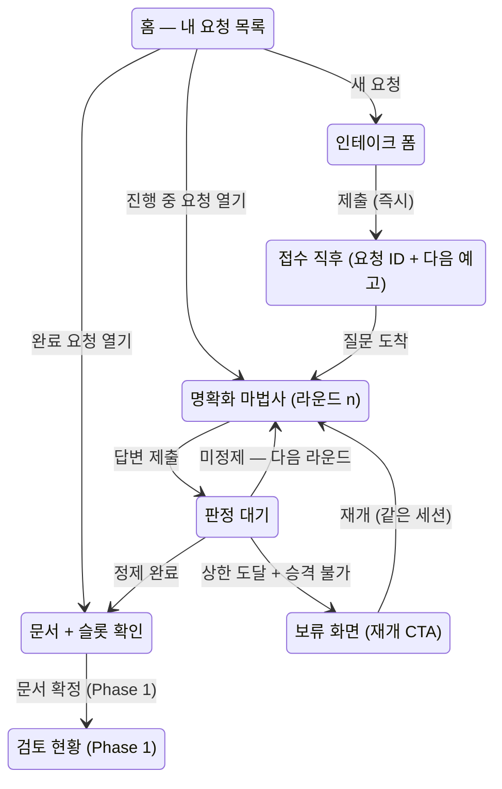

# 요청자 여정 UX 설계 — 세션 상태 머신의 화면 대응

> 성격: [ARCHITECTURE.md §상태 머신](../../ARCHITECTURE.md)과 [PRD §5·§7](../prd/functional-requirements.md)이 정본인 요청 라이프사이클을, 요청자가 보는 화면·상호작용으로 대응시키는 설계 문서다(보드 #23, 운영자 지시). 화면 구현은 이 설계의 승인 뒤에 진행한다. 용어는 [CONTEXT.md](../../CONTEXT.md)를 따른다.

## 1. 문제 정의

기존 웹 표면(#16·#22)은 화면 단위로 만들어졌고, 상태 머신 전 구간을 관통하는 요청자 여정 설계가 없었다. 결과:

- 요청자는 자신의 요청이 **전체 여정 중 어디에 있는지** 볼 수 없다 (라운드 내 진행률만 존재).
- 상태 머신의 정본 구간 중 **화면이 아예 없는 구간**이 있다 — 슬롯 단위 요청자 확인(F3), 보류 → 재개 전이, 컨텍스트 검색·중복 후보(F2a), 게이트 이후 전 구간(F5~F8).
- 세션이 브라우저 저장소의 단일 ID로만 이어져 **요청 목록·딥링크·재방문 동선**이 없다.
- 왕복 상한·승격 같은 상태 머신 규칙이 **요청자에게 예고 없이** 발동한다.

## 2. UX 설계 원칙

정본 원칙(PRD §3)의 화면 번역이다. 이후 모든 화면 설계는 이 여섯을 만족해야 한다.

| # | 원칙 | 근거 정본 |
|---|---|---|
| P-U1 | **침묵 없음** — 모든 비동기 경계(접수·판정·문서 생성·게이트)는 즉시 피드백 + 진행 표시 + 예상 소요를 갖는다 | F1 3초 확인, 원칙 5 |
| P-U2 | **상시 재개** — 어떤 상태에서 이탈해도 복귀 시 같은 자리에서 이어진다. 세션 나열·딥링크·복원이 전제다 | 세션 연속성(§6) |
| P-U3 | **막힘 없음** — 「모르겠다」도 유효한 답이다. 요청자가 답할 수 없어서 여정이 멈추는 상태는 존재하지 않는다 | US-10, F2c 승격 |
| P-U4 | **위치 가시성** — 요청자는 항상 전체 여정 스테퍼 위에서 현재 위치를 본다 | F9 진행도 |
| P-U5 | **다음 예고** — 각 단계의 끝에서 다음에 무슨 일이 일어나는지·누가 하는지·언제까지인지 알린다. 상한·자동 전환은 발동 전에 예고한다 | F5 SLA, F2c 상한 |
| P-U6 | **채널 등가** — 여기서 설계한 대화 계약(질문 구조·확인·회신)은 Slack 복귀 시 동일하게 성립해야 한다. 화면 전용 개념을 만들지 않는다 | 원칙 1 |

## 3. 여정 지도

요청자 관점의 전체 여정. 정본 상태 머신의 상태를 요청자 언어의 5단계 스테퍼로 접는다 — 스테퍼는 모든 화면 상단에 상주한다(P-U4).

```
① 접수  →  ② 내용 정리  →  ③ 문서 확정  →  ④ 개발팀 검토  →  ⑤ 진행·완료
   │            │                │                │  (Phase 1)        (Phase 1)
   │            │                │                ├─ 백로그(재부상 대기)
   │            │                │                └─ 거절(사유 + 이의 경로)
   │            └─ 보류(정보 부족) ⟲ 재개
   └─ 중복 병합(기존 요청 구독) (Phase 1, F2a)
```

정본 상태 → 스테퍼 대응: 인테이크·컨텍스트 검색 = ①, 명확화 루프·승격 판정 = ②, 문서 생성·슬롯 확인·목업 = ③, 승인 게이트 = ④, 이슈 생성·추적·역보고 = ⑤. 종결 상태 5종은 스테퍼 밖 별도 표식이 아니라 **해당 단계 위에 결과로 표시**된다(예: ② 위에 보류, ④ 위에 백로그).



## 4. 상태 ↔ 화면 매핑

서버 세션 상태(정본)와 클라이언트 대기 상태(화면 전용)를 구분한다. 「판정 중」은 세션 상태가 아니라 클라이언트가 응답을 기다리는 상태다.

| 정본 상태 | 화면 | 요청자가 보는 것 | 요청자가 하는 것 | 이탈·복귀 |
|---|---|---|---|---|
| (없음) | 홈 — 내 요청 목록 | 요청 카드(제목·상태 칩·마지막 갱신), 새 요청 CTA | 요청 열기 / 새 요청 | 시작점 |
| intake (생성 직후) | 접수 직후 | 요청 ID, 접수 확인, "지금 질문을 만들고 있어요" | 대기 (이탈 가능 고지) | 복귀 시 질문 도착 상태로 |
| clarifying | 명확화 마법사 | 스테퍼 ②, 라운드 맥락 카드("이만큼 정리됐어요 / N가지 남았어요"), 질문 카드(객관식 + 모르겠다 + 직접 입력), 마지막 라운드 예고 | 문항 답변, 답변 확인, 제출 | latestQuestions로 복원 |
| (클라이언트) 판정 대기 | 대기 카드 | 단계 메시지·경과·"떠나도 됩니다" | 없음 (타임아웃 시 이탈 경로) | 복귀 시 서버 상태 기준 재분기 |
| documented | 문서 + 슬롯 확인 | 문서 전문, 채워진 슬롯 값 카드, 오픈이슈("개발팀 확인 N건") 구분, 다음 단계 예고 | 슬롯 값 맞음/아님 확인(F3), 전사 열람 | 딥링크 상시 |
| closed + 보류(정보 부족) | 보류 화면 | 사유 + 무엇이 부족했는지(미충족 슬롯 이름) | **이어서 보태기(같은 세션 재개)** / 새 요청 | 재개 시 clarifying 복귀 |
| closed + 중복 병합 (Ph.1) | 병합 안내 | 연결된 기존 요청, 구독 등록 확인 | 기존 요청 진행 보기 | ⑤로 합류 |
| gate 대기·결과 (Ph.1) | 검토 현황 | 수신자·라우팅 근거·SLA 잔여, 결과(승인/질문/백로그/거절+이의 경로) | 질문 회신(②로 복귀), 이의 제기 | — |
| 추적·역보고 (Ph.1) | 진행 현황 | 이슈 상태 변화 이력 | 열람 | — |

## 5. 화면별 설계

### 5.1 홈 — 내 요청 목록 (신규)

단일 세션 localStorage의 대체. 간이 식별 체계(ADR-0007) 아래에서 "내 요청"의 경계는 **브라우저가 만든 세션 목록**(localStorage에 세션 ID 배열)이다 — 서버 전체 목록 API는 열지 않는다(타인 요청 노출 방지, 오픈 질문 Q1).

- 요청 카드: 요청 첫 문장(원문), 상태 칩(정리 중 · 라운드 n / 문서 완성 / 보류 / 검토 중), 마지막 갱신 시각, 오픈이슈 수.
- 빈 상태: 인테이크 폼을 홈에 바로 노출 (첫 방문 = 폼이 곧 홈).
- 각 카드는 딥링크 `/s/<sessionId>`로 열린다 — URL 공유·재방문이 세션 복원의 1차 경로, localStorage는 목록 캐시(P-U2).

### 5.2 인테이크 → 접수 직후

- 폼은 현행(이름·언어·요청)을 유지하되, 제출 즉시 **접수 화면으로 전환**한다: 요청 ID·접수 확인 문구·"질문을 만들고 있어요" 진행 표시. 접수 확인은 질문 생성 완료를 기다리지 않는다(F1 3초 — 현행 단일 응답 버퍼링은 이 원칙 위반, 구현 갭 G-1).
- 접수 직후 화면에서 명시: "이 페이지를 닫아도 요청은 사라지지 않아요 — 목록에서 언제든 이어집니다."
- Phase 1 자리: 접수 직후 "비슷한 요청 확인"(F2a) 단계가 이 지점에 삽입되고, 중복 후보 수락 시 병합 안내 화면으로 분기한다.

### 5.3 명확화 마법사 (라운드 n)

현행 문항별 마법사(객관식 + 「모르겠다」 + 직접 입력, 답변 확인 단계)를 유지하고 다음을 더한다:

- **라운드 맥락 카드** (2라운드부터): 라운드 시작 전에 "지금까지 이만큼 정리됐어요"(충족 슬롯 값 요약) + "N가지가 더 필요해요"(남은 슬롯 라벨). 같은 것을 반복해서 묻는 인상을 차단하고, 왕복이 축적임을 보여준다. 데이터는 기존 slotStates로 충분하다.
- **마지막 라운드 예고**: 남은 라운드가 1이면 배지 「마지막 확인」과 안내 — "이번에 정리되지 않은 항목은 개발팀 확인으로 넘기거나, 요청을 보류로 정리해요." 상한 발동을 예고 없는 강제 종결에서 예고된 규칙으로 바꾼다(P-U5). 서버가 maxRounds를 노출해야 한다(G-2).
- **승격의 인과 표시**: 「모르겠다」 선택 시 문항 아래 마이크로카피 — "이 항목은 개발팀 확인 목록에 올라가요. 요청은 계속 진행됩니다." 문서 화면의 오픈이슈와 연결되는 인과를 선택 시점에 보여준다(P-U3).

### 5.4 판정 대기

현행 대기 카드(단계 메시지 회전·경과·2분 안내·150초 타임아웃)를 유지하고 다음을 더한다:

- 스테퍼 상주 — 대기 중에도 위치가 보인다.
- 대기 종류 구분: 질문 생성 대기(①→②) / 판정 대기(② 내) / 문서 생성 대기(②→③) — 메시지 세트가 이미 구분돼 있으므로 스테퍼 위치만 정확히.
- 이탈 문구를 접수 직후와 통일: "떠나도 됩니다 — 돌아오면 이 자리부터."

### 5.5 문서 + 슬롯 단위 요청자 확인

정본 상태 「문서 생성 + 슬롯 확인(F3)」의 후반부가 현재 화면에 없다(G-3). 설계:

- 문서 전문 위에 **정리 결과 카드**: 채워진 슬롯 값(요청자 언어, 슬롯 단위 — 원칙 7 번역 무결성 장치)을 나열하고 각 값에 「맞아요 / 아니에요」. 「아니에요」는 해당 슬롯만 되묻는 미니 라운드로 이어진다.
- **오픈이슈 구분**: "개발팀이 확인할 항목 N건" 배지 + 각 항목에 "당신이 답하지 않아도 됩니다" 명시. 조건부 상정(게이트 도입 후)의 시각 구분을 여기서부터 준비한다.
- **다음 예고**: Phase 0에서는 정직하게 — "다음 단계인 개발팀 검토는 준비 중입니다. 지금은 이 문서가 개발팀에 전달됩니다." 게이트 도입 시 이 자리가 검토 현황 링크로 바뀐다.
- 원문 전사는 현행대로 접힘 열람(참고용 — 구현 근거는 문서뿐, 원칙 7).

### 5.6 보류(정보 부족) → 재개

- 보류 화면: 종결 사유 + **무엇이 부족했는지**(미충족 슬롯 라벨 나열) + 두 CTA — 「이어서 보태기」(주) / 「새 요청」(부).
- 「이어서 보태기」는 **같은 세션의 재개**다: 입력창에 보탤 내용을 적으면 세션이 clarifying으로 복귀하고 전사·슬롯·라운드 이력이 이어진다. 정본 전이 `보류 → 명확화(요청자 재개)`가 근거이며, 현행 코어는 종결 세션의 답변을 무시하므로 코어에 재개 전이 구현이 필요하다(G-4). 현행 「새 요청」 단일 경로는 축적을 버리는 UX 위반.

### 5.7 Phase 1 자리 (설계만 확보)

- **검토 현황(게이트)**: 수신자와 라우팅 근거("대시보드 영역 담당"), SLA 잔여, 결과 4종 + 거절 사유·이의 경로, 게이트 질문 시 ②로 복귀하는 미니 라운드. 백로그는 재부상 규칙 안내와 함께.
- **진행·완료(역보고)**: 이슈 상태 변화 이력, 완료 시 CSAT 1문항.
- **중복 병합**: 후보 제시("3월에 비슷한 요청이 있었어요") → 수락 시 구독 등록 확인 + 기존 요청 진행 보기.

## 6. 상호작용 계약 — 상태 머신과의 접점

| 계약 | 내용 |
|---|---|
| 상태의 진실 원천 | 화면 전이는 항상 서버 status·terminalState 기준. 클라이언트는 대기 상태만 소유한다 |
| 재개 | 진입은 항상 `GET 세션` → 상태 기준 재분기. 딥링크·목록·localStorage 모두 같은 경로를 탄다 |
| 라운드 | roundCount·maxRounds·남은 슬롯이 세션 조회에 실려야 라운드 맥락·마지막 라운드 예고가 성립한다 |
| 승격 | 「모르겠다」 선택 → (마법사) 인과 마이크로카피 → (문서) 오픈이슈 항목 — 한 사건의 두 표면 |
| 슬롯 확인 | 「아니에요」는 새 라운드가 아니라 해당 슬롯 한정 되물음 — 왕복 상한에 산입하지 않는다(제안, 오픈 질문 Q5) |
| 시간 | 모든 대기에 경과 표시, 타임아웃은 이탈 경로 포함, 상한·자동 전환은 발동 전 예고 |
| 언어 | 대화·chrome 모두 요청자 언어(ko/en), 문서는 팀 표준 언어 + 슬롯 확인은 요청자 언어(F2d) |

## 7. 현행(#21) 대비 구현 갭

| # | 갭 | 관련 정본 | 제안 우선순위 |
|---|---|---|---|
| G-1 | 접수 확인이 질문 생성 완료까지 버퍼링됨 — 즉시 접수 화면 없음 | F1 3초 | 높음 |
| G-2 | maxRounds·남은 슬롯이 세션 조회에 없음 — 라운드 맥락·마지막 라운드 예고 불가 | F2c | 높음 |
| G-3 | 슬롯 단위 요청자 확인 화면 없음 | F3, 원칙 7 | 높음 |
| G-4 | 보류 재개 전이 미구현(코어가 종결 세션 답변 무시) — 「새 요청」뿐 | 상태 머신 정본 전이 | 높음 |
| G-5 | 세션 목록·딥링크 없음 — 단일 localStorage 키 | P-U2 | 중간 |
| G-6 | 전체 여정 스테퍼 없음 — 라운드 내 진행률만 | P-U4 | 중간 |
| G-7 | 승격 인과 마이크로카피 없음 (선택 → 오픈이슈 연결이 암묵) | P-U3 | 낮음 |
| G-8 | chrome 다국어 미지원 (en 요청자에게 한국어 고정) | F2d | 낮음 |

## 8. 오픈 질문 (운영자 결정 대기)

- **Q1 — 세션 목록의 경계**: 브라우저 로컬 목록(제안)로 충분한가, 간이 식별(이름) 기반 서버 목록이 필요한가. 후자는 타인 요청 열람 문제가 생겨 Phase 1 매직 링크와 함께 푸는 것이 자연스럽다.
- **Q2 — 보류 재개(G-4)의 Phase 0 포함 여부**: 코어 상태 전이 추가가 필요하다. 정본 전이가 이미 존재하므로 포함을 제안한다.
- **Q3 — 접수 즉시성(G-1)의 구현 방식**: ⓐ 2단계 API(세션 생성 즉시 응답 + 질문 폴링) ⓑ SSE 스트리밍. PoC 단순성 기준 ⓐ 제안.
- **Q4 — Phase 1 자리의 노출 수위**: 문서 화면의 "개발팀 검토 준비 중" 예고를 지금 노출할지, 게이트 구현 전까지 숨길지.
- **Q5 — 슬롯 확인 되물음의 상한 산입 여부**: 미산입 제안(확인은 정정이지 새 왕복이 아니다) — 확정 시 PRD §12 결정 목록에 등재.
